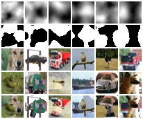

<div align="center">
  
# FMix

This repository contains the __official__ implementation of the paper ['FMix: Enhancing Mixed Sampled Data Augmentation'](https://arxiv.org/abs/2002.12047)

[](https://paperswithcode.com/sota/image-classification-on-cifar-10?p=understanding-and-enhancing-mixed-sample-data)
[](https://paperswithcode.com/sota/image-classification-on-fashion-mnist?p=understanding-and-enhancing-mixed-sample-data)

<p align="center">
  <a href="https://arxiv.org/abs/2002.12047">ArXiv</a> •
  <a href="https://paperswithcode.com/paper/understanding-and-enhancing-mixed-sample-data">Papers With Code</a> •
  <a href="#about">About</a> •
  <a href="#experiments">Experiments</a> •
  <a href="#implementations">Implementations</a> •
  <a href="#pre-trained-models">Pre-trained Models</a>
</p>

<a href="https://colab.research.google.com/github/ecs-vlc/fmix/blob/master/notebooks/example_masks.ipynb">

  
Dive in with our example notebook in Colab!
</a>

</div>

## About

FMix is a variant of MixUp, CutMix, etc. introduced in our paper ['FMix: Enhancing Mixed Sampled Data Augmentation'](https://arxiv.org/abs/2002.12047). It uses masks sampled from Fourier space to mix training examples. Take a look at our [example notebook in colab](https://colab.research.google.com/github/ecs-vlc/fmix/blob/master/notebooks/example_masks.ipynb) which shows how you can generate masks in two dimensions

<div align="center">
  
</div>

and in three!

<div align="center">
  
</div>

## Experiments

### Core Experiments

Shell scripts for our core experiments can be found in the [experiments folder](./experiments). For example,

```bash
bash cifar_experiment cifar10 resnet fmix ./data
```

will train a PreAct-ResNet18 on CIFAR-10 with FMix. More information can be found at the start of each of the shell files.

### Additional Experiments

All additional classification experiments can be run via [`trainer.py`](./trainer.py)

### Analyses

For Grad-CAM, take a look at the [Grad-CAM notebook in colab](https://colab.research.google.com/github/ecs-vlc/fmix/blob/master/notebooks/grad_cam.ipynb).

For the other analyses, have a look in the [analysis folder](./analysis).

## Implementations

The core implementation of `FMix` uses `numpy` and can be found in [`fmix.py`](./fmix.py). We provide bindings for this in [PyTorch](https://pytorch.org/) (with [Torchbearer](https://github.com/pytorchbearer/torchbearer) or [PyTorch-Lightning](https://github.com/PyTorchLightning/pytorch-lightning)) and [Tensorflow](https://www.tensorflow.org/).

### Torchbearer

The `FMix` callback in [`torchbearer_implementation.py`](./implementations/torchbearer_implementation.py) can be added directly to your torchbearer code:

```python
from implementations.torchbearer_implementation import FMix

fmix = FMix()
trial = Trial(model, optimiser, fmix.loss(), callbacks=[fmix])
```

See an example in [`test_torchbearer.py`](./implementations/test_torchbearer.py).

### PyTorch-Lightning

For PyTorch-Lightning, we provide a class, `FMix` in [`lightning.py`](./implementations/lightning.py) that can be used in your `LightningModule`:

```python
from implementations.lightning import FMix

class CoolSystem(pl.LightningModule):
    def __init__(self):
        ...
        
        self.fmix = FMix()
    
    def training_step(self, batch, batch_nb):
        x, y = batch
        x = self.fmix(x)

        x = self.forward(x)

        loss = self.fmix.loss(x, y)
        return {'loss': loss}
```

See an example in [`test_lightning.py`](./implementations/test_lightning.py).

### Tensorflow

For Tensorflow, we provide a class, `FMix` in [`tensorflow_implementation.py`](./implementations/tensorflow_implementation.py) that can be used in your tensorflow code:

```python
from implementations.tensorflow_implementation import FMix

fmix = FMix()

def loss(model, x, y, training=True):
    x = fmix(x)
    y_ = model(x, training=training)
    return tf.reduce_mean(fmix.loss(y_, y))
```

See an example in [`test_tensorflow.py`](./implementations/test_tensorflow.py).

## Pre-trained Models

We provide pre-trained models via `torch.hub` (more coming soon). To use them, run

```python
import torch
model = torch.hub.load('ecs-vlc/FMix:master', ARCHITECTURE, pretrained=True)
```

where `ARCHITECTURE` is one of the following:

### CIFAR-10

#### PreAct-ResNet-18

| Configuration    | `ARCHITECTURE`                            | Accuracy |
| ---------------- | ----------------------------------------- | -------- |
| Baseline         | `'preact_resnet18_cifar10_baseline'`      | -------- |
|   + MixUp        | `'preact_resnet18_cifar10_mixup'`         | -------- |
|   + FMix         | `'preact_resnet18_cifar10_fmix'`          | -------- |
|   + Mixup + FMix | `'preact_resnet18_cifar10_fmixplusmixup'` | -------- |

#### PyramidNet-200

| Configuration    | `ARCHITECTURE`                       | Accuracy  |
| ---------------- | ------------------------------------ | --------- |
| Baseline         | `'pyramidnet_cifar10_baseline'`      | 98.31     |
|   + MixUp        | `'pyramidnet_cifar10_mixup'`         | 97.92     |
|   + FMix         | `'pyramidnet_cifar10_fmix'`          | __98.64__ |

### ImageNet

#### ResNet-101

| Configuration    | `ARCHITECTURE`                       | Accuracy (Top-1) |
| ---------------- | ------------------------------------ | ---------------- |
| Baseline         | `'renset101_imagenet_baseline'`      | 76.51            |
|   + MixUp        | `'renset101_imagenet_mixup'`         | 76.27            |
|   + FMix         | `'renset101_imagenet_fmix'`          | __76.72__        |
